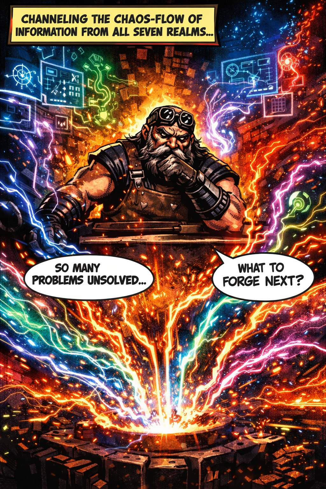

# Sindri

[](LICENSE)
[](https://github.com/pacphi/sindri/actions/workflows/ci-v2.yml)
[](https://github.com/pacphi/sindri/actions/workflows/ci-v3.yml)
[](https://sindri-faq.fly.dev)
[](https://github.com/pacphi/sindri/pkgs/container/sindri)
[](v3/docs/image-management.md#security)

A declarative, provider-agnostic cloud development environment system. Deploy consistent development environments to Fly.io, local Docker, or via DevPod to Kubernetes, AWS, GCP, Azure, and other cloud providers using YAML-defined extensions.

**🔐 Secure Supply Chain:** All release images are signed with Cosign, include SBOM (Software Bill of Materials), and have SLSA Level 3 provenance attestations.

```text
   ███████╗██╗███╗   ██╗██████╗ ██████╗ ██╗
   ██╔════╝██║████╗  ██║██╔══██╗██╔══██╗██║
   ███████╗██║██╔██╗ ██║██║  ██║██████╔╝██║
   ╚════██║██║██║╚██╗██║██║  ██║██╔══██╗██║
   ███████║██║██║ ╚████║██████╔╝██║  ██║██║
   ╚══════╝╚═╝╚═╝  ╚═══╝╚═════╝ ╚═╝  ╚═╝╚═╝

   🔨 Forging Development Environments
   📦 https://github.com/pacphi/sindri
```

## About the Name

**Sindri** (Old Norse: "spark") was a legendary dwarf blacksmith in Norse mythology, renowned for forging three of the most powerful artifacts: Mjölnir (Thor's hammer), Draupnir (Odin's ring), and Gullinbursti (Freyr's golden boar).

Like its mythological namesake, Sindri forges powerful development environments from raw materials—transforming cloud infrastructure, YAML configuration, and Docker into consistent, reproducible developer workspaces.

## Versions

- **[v2](v2)** - Bash/Docker implementation (stable)
- **[v3](v3)** - Rust CLI implementation (active development)

## Quick Start (v3)

### Install

```bash
# Pull the Docker image
docker pull ghcr.io/pacphi/sindri:v3

# Or download the CLI binary
wget https://github.com/pacphi/sindri/releases/latest/download/sindri-linux-x86_64.tar.gz
tar -xzf sindri-linux-x86_64.tar.gz
sudo mv sindri /usr/local/bin/
```

### Deploy

```bash
# Initialize configuration
sindri config init --provider kubernetes

# Deploy with automatic image version resolution
sindri deploy

# Verify image security
sindri image verify ghcr.io/pacphi/sindri:v3.0.0
```

### Image Management

```bash
# List available versions
sindri image list

# Inspect image details
sindri image inspect ghcr.io/pacphi/sindri:v3.0.0 --sbom

# Check current image
sindri image current
```

## Features

### 🎯 Provider-Agnostic

Deploy to multiple cloud providers using the same configuration:

- Docker & Docker Compose
- Fly.io
- Kubernetes (kind, k3d, EKS, GKE, AKS)
- DevPod (AWS, GCP, Azure, DigitalOcean)
- E2B

### 🔐 Security-First

- **Signed Images**: All releases signed with Cosign (keyless)
- **SBOM**: Software Bill of Materials in SPDX format
- **SLSA Provenance**: Level 3 build attestations
- **Vulnerability Scanning**: Trivy scans on every CI build

### 📦 Container Image Lifecycle

- **Build Once, Promote Often**: CI builds once, releases retag (no rebuild)
- **Version Resolution**: Semantic versioning constraints
- **Signature Verification**: Automatic verification before deployment
- **Registry-First**: GHCR as single source of truth

### 🔧 Extension System

Install development tools declaratively using profiles or individual extensions.

## License

MIT License - see [LICENSE](LICENSE) file for details.


