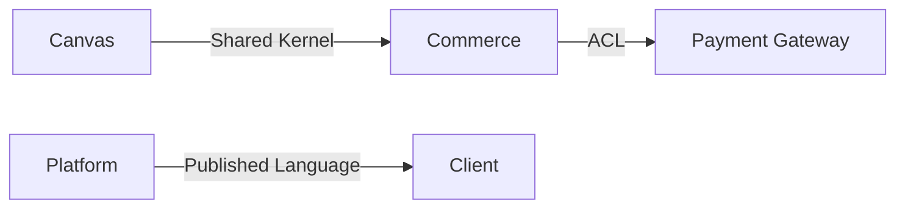
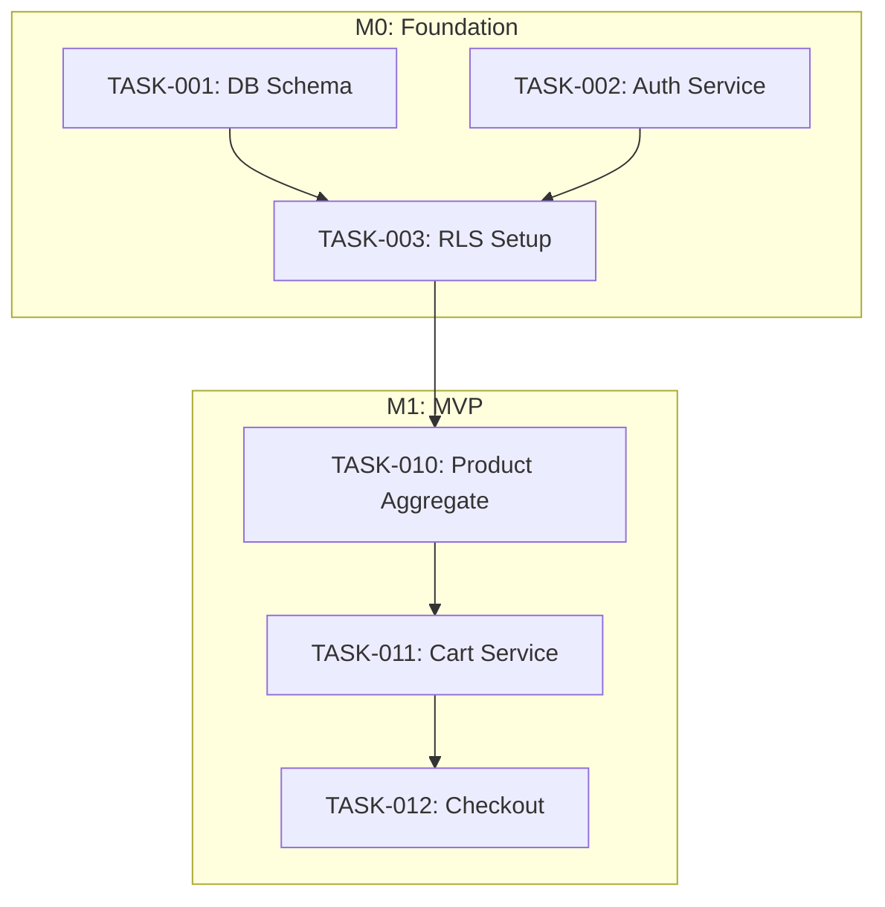

# PRD to Documentation Workflow

You are executing a comprehensive documentation generation workflow from a Product Requirements Document (PRD). This workflow is designed for AI-assisted development with session continuity.

## Input PRD

$ARGUMENTS

---

## MANDATORY: Swarm Orchestration Protocol

**This workflow MUST use Claude-Flow swarm orchestration for parallel execution and specialized agent assignment.**

### Phase 0: Swarm Initialization (EXECUTE FIRST)

Before any documentation work, initialize the swarm:

```javascript
// SINGLE MESSAGE - Initialize swarm with all agent spawns
[Parallel Execution - REQUIRED]:

  // 1. Initialize hierarchical swarm topology
  mcp__claude-flow__swarm_init({
    topology: "hierarchical-mesh",
    maxAgents: 8,
    config: {
      consensusMechanism: "raft",
      communicationPattern: "pubsub",
      loadBalancing: true
    }
  })

  // 2. Store PRD in shared memory for all agents
  mcp__claude-flow__memory__store({
    content: "[PRD content here]",
    type: "semantic",
    category: "prd-source",
    namespace: "prd-docs-session",
    importance: 1.0
  })

  // 3. Spawn specialized agents for each domain
  Task("Specification Analyst", "Extract requirements, user stories, API contracts from PRD", "researcher")
  Task("DDD Expert", "Model domain using bounded contexts, aggregates, sagas", "code-analyzer")
  Task("Architecture Reviewer", "Generate ADRs with rationale and alternatives", "reviewer")
  Task("SPARC Planner", "Create implementation-ready SPARC documentation", "planner")
  Task("Security Auditor", "Review security model, threat analysis, auth flows", "security-architect")
  Task("Implementation Planner", "Generate tasks, epics, milestones, dependencies", "coder")

  // 4. Create all documentation directories
  Bash "mkdir -p docs/{specification,ddd,adr,sparc,implementation/{milestones,epics,tasks}}"
```

### Agent Assignment by Phase

| Phase | Primary Agent | Supporting Agents | Parallel With |
|-------|---------------|-------------------|---------------|
| Phase 1: Specification | `researcher` | `security-architect` | - |
| Phase 2: DDD | `code-analyzer` | `reviewer` | Phase 1 |
| Phase 3: ADR | `reviewer` | `security-architect` | Phase 1, 2 |
| Phase 4: SPARC | `planner` | `tester` | Phase 3 |
| Phase 5: Summary | `planner` | - | After 1-4 |
| Phase 6: Implementation | `coder` | `planner` | After 1-4 |

### Parallel Execution Strategy

**Phases 1, 2, 3 can run concurrently** - they read from PRD, write to separate directories:

```javascript
// SINGLE MESSAGE - Launch parallel documentation agents
[Parallel Phase Execution]:

  // Phase 1: Specification (researcher agent)
  Task("Specification Analyst", `
    Read PRD from memory (namespace: prd-docs-session).
    Generate docs/specification/:
    - requirements.md (REQ-XXX IDs)
    - non-functional.md
    - user-stories.md (US-XXX format)
    - api-contracts.md (OpenAPI style)
    - security-model.md
    - edge-cases.md, constraints.md, glossary.md

    Store extracted entities in memory for DDD agent.
    Run pre-task and post-task hooks.
  `, "researcher")

  // Phase 2: DDD (code-analyzer agent)
  Task("DDD Expert", `
    Read PRD from memory (namespace: prd-docs-session).
    Generate docs/ddd/:
    - domain-model.md, bounded-contexts.md
    - context-map.md (with relationship types)
    - ubiquitous-language.md
    - aggregates.md, entities.md, value-objects.md
    - domain-events.md, sagas.md
    - repositories.md, services.md

    Store aggregate list in memory for task generation.
    Run pre-task and post-task hooks.
  `, "code-analyzer")

  // Phase 3: ADR (reviewer agent)
  Task("Architecture Reviewer", `
    Read PRD from memory (namespace: prd-docs-session).
    Generate docs/adr/:
    - index.md (registry with dependency graph)
    - ADR-001 through ADR-XXX for mandatory categories:
      Architecture, Database, API, Security, Infrastructure,
      Integration, Frontend, Testing, Observability

    Use enhanced ADR template with Metadata, Impact Radius, Related Decisions.
    Store ADR index in memory for task linking.
    Run pre-task and post-task hooks.
  `, "reviewer")
```

### Memory Coordination Protocol

All agents MUST use shared memory for cross-agent coordination:

```javascript
// Store outputs for downstream agents
mcp__claude-flow__memory__store({
  content: { aggregates: [...], services: [...] },
  type: "semantic",
  category: "ddd-artifacts",
  namespace: "prd-docs-session",
  tags: ["phase-2", "ddd", "aggregates"],
  importance: 0.9
})

// Retrieve upstream outputs
mcp__claude-flow__memory__search({
  query: "DDD aggregates from PRD",
  namespace: "prd-docs-session",
  type: "semantic",
  limit: 10
})
```

### Hook Integration (Self-Learning)

Every agent MUST run hooks for learning and coordination:

```bash
# BEFORE starting phase work
npx claude-flow@alpha hooks pre-task --description "Phase X: [description]"

# AFTER creating each document
npx claude-flow@alpha hooks post-edit --file "docs/[path]" --memory-key "prd-docs/[phase]/[doc]"

# AFTER completing phase
npx claude-flow@alpha hooks post-task --task-id "phase-X-[name]"
```

### Session Continuity via Memory

At end of each session, persist state:

```javascript
// Store session state for next session
mcp__claude-flow__memory__store({
  content: {
    completedPhases: [1, 2, 3],
    inProgressPhase: 4,
    generatedDocs: ["docs/specification/requirements.md", ...],
    pendingTasks: ["TASK-044", "TASK-045"],
    lastActivity: "2026-01-12T10:30:00Z"
  },
  type: "episodic",
  category: "session-state",
  namespace: "prd-docs-session",
  importance: 1.0
})

// Also update STATUS.md as human-readable backup
```

---

## Workflow Execution

Execute the following phases using the swarm orchestration protocol above.

---

### Phase 1: PRD Analysis & Specification

**Objective**: Extract and document all requirements from the PRD.

1. Read and analyze the provided PRD thoroughly
2. Create `docs/specification/` directory with:

| File | Purpose |
|------|---------|
| `requirements.md` | Functional requirements extracted from PRD (with REQ-XXX IDs) |
| `non-functional.md` | NFRs (performance, security, scalability targets) |
| `user-stories.md` | **NEW** - User stories in "As a [role], I want [feature], so that [benefit]" format |
| `api-contracts.md` | **NEW** - API endpoint specifications (OpenAPI-style) |
| `security-model.md` | **NEW** - Threat model, authentication flows, security requirements |
| `edge-cases.md` | Edge cases and boundary conditions |
| `constraints.md` | Technical and business constraints |
| `glossary.md` | Domain terminology definitions |

**User Stories Format:**
```markdown
## US-001: [Story Title]
**As a** [role]
**I want** [feature/capability]
**So that** [benefit/value]

### Acceptance Criteria
- [ ] Criterion 1
- [ ] Criterion 2

### Related
- Requirements: REQ-001, REQ-002
- Epic: EPIC-XXX
```

**API Contracts Format:**
```markdown
## POST /api/v1/resource

### Request
| Field | Type | Required | Description |
|-------|------|----------|-------------|
| name | string | Yes | Resource name |

### Response (200)
| Field | Type | Description |
|-------|------|-------------|
| id | uuid | Created resource ID |

### Errors
| Code | Description |
|------|-------------|
| 400 | Validation error |
| 401 | Unauthorized |
```

---

### Phase 2: DDD Documentation

**Objective**: Model the domain using Domain-Driven Design patterns.

1. Identify bounded contexts from the requirements
2. Create `docs/ddd/` directory with:

| File | Purpose |
|------|---------|
| `domain-model.md` | Core domain model overview and strategic design |
| `bounded-contexts.md` | Context boundaries, responsibilities, and ownership |
| `context-map.md` | **NEW** - Relationships between contexts (ACL, Shared Kernel, Conformist, etc.) |
| `ubiquitous-language.md` | **NEW** - Per-context language dictionary |
| `aggregates.md` | Aggregate roots and consistency boundaries |
| `entities.md` | Domain entities with identity |
| `value-objects.md` | Immutable value objects |
| `domain-events.md` | Event catalog with triggers and handlers |
| `sagas.md` | **NEW** - Long-running processes and process managers |
| `repositories.md` | Repository interfaces |
| `services.md` | Domain and application services |

**Context Map Format:**
```markdown
## Context Relationships



### Relationship Types

| Upstream | Downstream | Type | Description |
|----------|------------|------|-------------|
| Commerce | Canvas | Shared Kernel | Product entity shared |
| Payment Gateway | Commerce | ACL | Anti-corruption layer for Stripe |
| Platform | Client | Published Language | Theme/module API contracts |
```

**Saga Format:**
```markdown
## SAGA-001: Checkout Process

### Trigger
CartCheckoutInitiated event

### Steps
1. **Validate Cart** → CartValidated | CartValidationFailed
2. **Reserve Inventory** → InventoryReserved | InventoryUnavailable
3. **Process Payment** → PaymentProcessed | PaymentFailed
4. **Create Order** → OrderCreated
5. **Send Confirmation** → ConfirmationSent

### Compensation (Rollback)
| Step Failed | Compensating Actions |
|-------------|---------------------|
| Payment | Release inventory reservation |
| Inventory | Cancel cart checkout |

### Related
- Aggregates: Cart, Order, Inventory
- Events: CartCheckoutInitiated, OrderCreated, PaymentProcessed
```

---

### Phase 3: ADR Generation

**Objective**: Document architectural decisions with rationale and relationships.

1. Identify key architectural decisions from the domain model
2. Create `docs/adr/` directory with ADR files using this enhanced template:

```markdown
# ADR-XXX: [Decision Title]

## Metadata
- **Status**: [Proposed | Accepted | Deprecated | Superseded by ADR-YYY]
- **Date**: YYYY-MM-DD
- **Deciders**: Claude (AI Developer)
- **Categories**: [Architecture | Security | Infrastructure | Integration | Testing]
- **Bounded Contexts**: [Which contexts this affects]

## Context
[What is the issue we're addressing?]

## Decision
[What is the change we're proposing?]

## Consequences
### Positive
- [Benefits]

### Negative
- [Trade-offs]

## Alternatives Considered
1. **[Alternative Name]**
   - Pros: [...]
   - Cons: [...]
   - Why rejected: [...]

## Impact Radius
| Affected Area | Impact Level | Notes |
|---------------|--------------|-------|
| [Module/Context] | High/Medium/Low | [Details] |

## Related Decisions
- **Depends on**: ADR-XXX
- **Supersedes**: ADR-YYY
- **Related to**: ADR-ZZZ

## Review
- **Review Date**: YYYY-MM-DD (6 months from acceptance)
```

3. Generate ADRs for these **mandatory categories**:

| Category | Required ADRs |
|----------|---------------|
| **Architecture** | System architecture style, module boundaries, binary distribution |
| **Database** | Database technology, schema design, multi-tenancy approach |
| **API** | API design style (REST/GraphQL), versioning, error handling |
| **Security** | Authentication, authorization, RLS, secrets management |
| **Infrastructure** | Deployment architecture, CDN, storage |
| **Integration** | External services (payments, email, storage) |
| **Frontend** | UI framework, state management, visual editor |
| **Testing** | Testing strategy, coverage targets, E2E approach |
| **Observability** | Logging, monitoring, error tracking |

4. Create `docs/adr/index.md` with:
   - ADR registry table (ID, Title, Status, Category, Date)
   - Dependency graph showing ADR relationships
   - Supersession chain for deprecated ADRs

---

### Phase 4: SPARC Phase Documentation

**Objective**: Generate implementation-ready SPARC documentation with traceability.

1. Create `docs/sparc/` directory with:

| File | Purpose |
|------|---------|
| `01-specification.md` | Detailed specifications with acceptance criteria |
| `02-pseudocode.md` | High-level algorithms and flow logic |
| `03-architecture.md` | System architecture with diagrams |
| `04-refinement.md` | TDD anchors and test specifications |
| `05-completion.md` | Integration checklist and deployment guide |
| `traceability-matrix.md` | **NEW** - Requirement to implementation mapping |

**Traceability Matrix Format:**
```markdown
## Traceability Matrix

| Requirement | User Story | DDD Artifact | ADR | Task | Test |
|-------------|------------|--------------|-----|------|------|
| REQ-001 | US-001 | Order Aggregate | ADR-003 | TASK-045 | order.test.ts |
| REQ-002 | US-002 | CheckoutService | ADR-008 | TASK-046 | checkout.test.ts |
```

---

### Phase 5: Build System Generation

**Objective**: Create a resumable build system document for session continuity and task tracking.

**Agent**: `planner` (uses outputs from all previous phases)

Generate `docs/build-system.md` with the following structure:

#### Required Sections

1. **Current Project State**
   - Milestone progress table (Status: Pending | In Progress | Complete)
   - Current task ID (e.g., TASK-057)
   - Progress percentages

2. **What's Completed**
   - Completed milestones/epics/tasks
   - File counts, test counts
   - Requirements coverage summary

3. **What's Needed Next**
   - Next 3-5 immediate tasks
   - File paths to create
   - Dependencies

4. **Resumable Workflow Instructions**
   - Step-by-step commands for each pending task
   - Exact Claude prompts to resume work
   - Reference documentation paths

5. **Session Resume Templates**
   - "Resume current work" command
   - "Resume after milestone" command
   - "Resume after long break" command

6. **SPARC Methodology Reference**
   - Links to specification, pseudocode, architecture, refinement, completion
   - Quick workflow reminder

7. **Quick Commands**
   - Build, test, lint commands specific to project
   - API testing examples
   - Database migration commands

8. **Documentation Cross-Reference**
   - Table mapping "when you need X, read Y"
   - Direct file paths

9. **Requirements Coverage Tracker**
   - Table by domain showing implemented vs total
   - Percentage coverage

10. **Quality Metrics**
    - Code metrics (files, LOC, tests)
    - Requirements metrics
    - Build status

11. **Troubleshooting Guide**
    - Common build errors and fixes
    - Test debugging commands
    - Documentation validation

**Template Structure:**
```markdown
# [Project Name] Build System - Resumable SPARC + TDD Workflow

> **Single Entry Point**: Read this file to resume development at any time

## Quick Start
[How to resume in one sentence]

## Current Project State
[Milestone table, current task, progress]

## What's Completed ✅
[Detailed breakdown by milestone/epic]

## What's Needed Next ⏳
[Next tasks with instructions]

## Resumable Workflow
[Step-by-step resume commands for each task]

## SPARC Methodology Reference
[Quick reference to 5 phases]

## Quick Commands
[Build, test, run commands]

## Documentation Cross-Reference
[Navigation table]

## Requirements Coverage Tracker
[Coverage by domain]

## Quality Metrics
[Current metrics vs targets]

## Troubleshooting
[Common issues and fixes]

**Last Updated:** [timestamp]
**Current Milestone:** [MX] - [XX]% complete
```

**This file serves as:**
- Single source of truth for project state
- Resume point for new Claude sessions
- Progress tracker for humans
- Command reference for common operations

---

### Phase 6: Documentation Summary (README)

1. Create `docs/README.md` with:
   - Overview of generated documentation
   - Navigation guide to all sections
   - Quick start for developers (Claude)
   - Links to all major documents
   - Document version and generation date

---

### Phase 7: Implementation Planning (NEW)

**Objective**: Create actionable implementation roadmap with task tracking for session continuity.

1. Create `docs/implementation/` directory structure:

```
docs/implementation/
├── STATUS.md                    # Session continuity tracker (CRITICAL)
├── roadmap.md                   # Master implementation plan
├── dependency-graph.md          # Visual DAG of all dependencies
├── risks.md                     # Risk register
├── definition-of-done.md        # DoD templates per task type
│
├── milestones/
│   ├── M0-foundation.md         # Core infrastructure tasks
│   ├── M1-mvp.md                # Minimum viable product
│   ├── M2-release.md            # Full v1.0 release
│   └── M3-enhanced.md           # Post-release enhancements
│
├── epics/
│   └── EPIC-XXX-[name].md       # One file per epic (business feature)
│
└── tasks/
    ├── index.md                 # Task registry with status
    └── TASK-XXX-[name].md       # One file per task (technical unit)
```

2. **STATUS.md** - Session Continuity Tracker (UPDATE EVERY SESSION):

```markdown
# Implementation Status

## Current State
**Last Updated**: YYYY-MM-DD HH:MM
**Current Milestone**: M1-MVP
**Overall Progress**: XX/YY tasks complete (ZZ%)

## Session Summary (YYYY-MM-DD)

### Completed This Session
- [x] TASK-XXX: Description
- [x] TASK-YYY: Description

### In Progress (Partial)
- [ ] TASK-ZZZ: Description
  - **Progress**: XX% - [what's done]
  - **Remaining**: [what's left]
  - **Files touched**: `path/to/file.rs`

### Blocked
- [ ] TASK-AAA: Description
  - **Blocker**: [what's blocking]
  - **Unblocked by**: [what would unblock]

## Next Session Actions
1. **Continue**: TASK-ZZZ (finish [specific work])
2. **Start**: TASK-BBB
3. **Review**: [anything needing review]

## Quick Stats
| Milestone | Total | Done | In Progress | Blocked |
|-----------|-------|------|-------------|---------|
| M0 | X | X | 0 | 0 |
| M1 | X | X | X | X |
| M2 | X | 0 | 0 | 0 |
```

3. **Epic Format** (Business-level features):

```markdown
# EPIC-XXX: [Feature Name]

## Business Value
[Why this matters to users/business]

## User Story
As a [role], I want [capability], so that [benefit].

## Bounded Context
[Which DDD context this belongs to]

## Constituent Tasks
| Task | Description | Status | Dependencies |
|------|-------------|--------|--------------|
| TASK-001 | [Technical task] | Not Started | None |
| TASK-002 | [Technical task] | Not Started | TASK-001 |

## Document References
| Type | Document | Relevant Section |
|------|----------|------------------|
| DDD | aggregates.md | [Aggregate name] |
| ADR | ADR-XXX | [Decision] |
| Spec | requirements.md | REQ-XXX |

## Definition of Done
- [ ] All constituent tasks complete
- [ ] Integration test passes
- [ ] Deployed to staging
- [ ] User acceptance verified
```

4. **Task Format** (Technical implementation units):

```markdown
# TASK-XXX: [Technical Task Name]

## Metadata
- **Epic**: EPIC-XXX
- **Milestone**: M1-MVP
- **Priority**: P1 (Critical) | P2 (High) | P3 (Medium) | P4 (Low)
- **Complexity**: Low | Medium | High
- **Status**: Not Started | In Progress | Blocked | Done

## Description
[What needs to be built]

## Dependencies
### Blocks (must complete these first)
- TASK-YYY: [Why needed]

### Blocked By (waiting on these)
- TASK-ZZZ: [What we're waiting for]

## Document References
| Type | Document | Section | Why Relevant |
|------|----------|---------|--------------|
| ADR | ADR-XXX.md | Decision | [Reason] |
| DDD | aggregates.md | [Name] | [Reason] |
| DDD | services.md | [Name] | [Reason] |
| Spec | api-contracts.md | [Endpoint] | [Reason] |

## Scope
### Files to Create/Modify
- `src/domain/aggregates/order.rs` - Create
- `src/api/routes/orders.rs` - Create

### Out of Scope
- [What this task does NOT include]

## Acceptance Criteria
- [ ] Criterion 1
- [ ] Criterion 2
- [ ] Unit tests pass (>80% coverage)
- [ ] Integration test passes

## Definition of Done
[Reference appropriate DoD template from definition-of-done.md]
```

5. **Task Auto-Generation Rules**:

For each DDD artifact, generate corresponding tasks:

| DDD Artifact | Generated Task(s) |
|--------------|-------------------|
| Aggregate | `Implement [Name] Aggregate` + `Create [Name]Repository` |
| Domain Service | `Implement [Name]Service` |
| Application Service | `Implement [Name]AppService` |
| Domain Event | `Implement [Name] Event + Handler` |
| Saga | `Implement [Name] Saga/Process Manager` |
| Repository | `Implement [Name]Repository` |
| API Endpoint (from api-contracts.md) | `Create [METHOD] [path] Endpoint` |
| UI Feature (from user-stories.md) | `Build [Feature] UI Component` |

6. **ADR Auto-Linking Rules**:

Auto-link ADRs to tasks based on keywords:

| ADR Topic | Keywords to Match in Task |
|-----------|---------------------------|
| Database/RLS | tenant, store, rls, isolation, multi-tenant |
| Payment | payment, checkout, stripe, order, transaction |
| Authentication | auth, login, session, token, jwt |
| Visual Editor | canvas, editor, grapesjs, blocks, visual |
| WASM | wasm, validator, image processing, search |
| API Design | endpoint, route, api, rest |

7. **Dependency Inference Rules**:

Auto-infer dependencies from:

| Source | Dependency Type |
|--------|-----------------|
| Context Map | Upstream context tasks block downstream |
| Aggregate references | Referencing aggregate must exist first |
| Service dependencies | Services depend on their injected repositories |
| API → Service | API endpoints depend on backing services |
| UI → API | UI components depend on API endpoints |

8. **Risk Register Format** (`risks.md`):

```markdown
# Risk Register

| ID | Task(s) | Risk Description | Likelihood | Impact | Mitigation |
|----|---------|------------------|------------|--------|------------|
| R1 | TASK-044 | External API changes | Low | High | Pin SDK version, integration tests |
| R2 | TASK-060 | Complex customization | Medium | Medium | Prototype first, validate approach |

## Risk Matrix
|            | Low Impact | Medium Impact | High Impact |
|------------|------------|---------------|-------------|
| **High**   | Monitor | Mitigate | Avoid |
| **Medium** | Accept | Monitor | Mitigate |
| **Low**    | Accept | Accept | Monitor |
```

9. **Definition of Done Templates** (`definition-of-done.md`):

```markdown
# Definition of Done Templates

## Aggregate Implementation
- [ ] Struct with all fields defined
- [ ] Constructor with validation
- [ ] Domain methods implemented
- [ ] Unit tests (>80% coverage)
- [ ] Repository interface defined
- [ ] Documentation comments

## Domain Service
- [ ] Service struct implemented
- [ ] All methods from DDD spec
- [ ] Dependencies injected via constructor
- [ ] Unit tests with mocked dependencies
- [ ] Error handling complete

## API Endpoint
- [ ] Route handler implemented
- [ ] Request/Response DTOs defined
- [ ] Input validation
- [ ] Authentication/authorization checks
- [ ] Error responses match spec
- [ ] Integration test
- [ ] OpenAPI spec updated

## UI Component
- [ ] React component implemented
- [ ] TypeScript props interface
- [ ] Responsive design (mobile, tablet, desktop)
- [ ] Accessibility (ARIA labels, keyboard nav)
- [ ] Loading/error states
- [ ] Component tests

## WASM Module
- [ ] Rust implementation complete
- [ ] wasm-bindgen exports defined
- [ ] JavaScript wrapper/bridge
- [ ] Browser compatibility verified
- [ ] Performance benchmarked
- [ ] Fallback for unsupported browsers
```

10. **Dependency Graph** (`dependency-graph.md`):

```markdown
# Dependency Graph

## Visual DAG



## Critical Path
The longest dependency chain determining minimum completion time:
1. TASK-001 → TASK-003 → TASK-010 → TASK-011 → TASK-012

## Parallelizable Tasks
Tasks with no dependencies between them:
- TASK-001 and TASK-002 (both M0, no interdependency)
- TASK-020 and TASK-030 (different epics)

## Blocked Tasks
| Task | Blocked By | Blocker Type |
|------|------------|--------------|
| TASK-012 | TASK-011 | Technical dependency |
| TASK-044 | User input | External (needs API keys) |
```

---

## Output Structure

```
docs/
├── README.md                           # Documentation overview
│
├── specification/
│   ├── requirements.md                 # Functional requirements (REQ-XXX)
│   ├── non-functional.md               # NFRs with targets
│   ├── user-stories.md                 # User stories (US-XXX)
│   ├── api-contracts.md                # API specifications
│   ├── security-model.md               # Security requirements
│   ├── edge-cases.md                   # Edge cases
│   ├── constraints.md                  # Constraints
│   └── glossary.md                     # Terminology
│
├── ddd/
│   ├── domain-model.md                 # Strategic design overview
│   ├── bounded-contexts.md             # Context definitions
│   ├── context-map.md                  # Context relationships
│   ├── ubiquitous-language.md          # Per-context language
│   ├── aggregates.md                   # Aggregate roots
│   ├── entities.md                     # Entities
│   ├── value-objects.md                # Value objects
│   ├── domain-events.md                # Events
│   ├── sagas.md                        # Process managers
│   ├── repositories.md                 # Repository interfaces
│   └── services.md                     # Services
│
├── adr/
│   ├── index.md                        # ADR registry + dependency graph
│   ├── ADR-001-*.md
│   └── ...
│
├── sparc/
│   ├── 01-specification.md
│   ├── 02-pseudocode.md
│   ├── 03-architecture.md
│   ├── 04-refinement.md
│   ├── 05-completion.md
│   └── traceability-matrix.md          # Requirement → Code mapping
│
└── implementation/
    ├── STATUS.md                       # Session continuity (UPDATE EVERY SESSION)
    ├── roadmap.md                      # Master plan
    ├── dependency-graph.md             # Task dependencies DAG
    ├── risks.md                        # Risk register
    ├── definition-of-done.md           # DoD templates
    │
    ├── milestones/
    │   ├── M0-foundation.md
    │   ├── M1-mvp.md
    │   ├── M2-release.md
    │   └── M3-enhanced.md
    │
    ├── epics/
    │   └── EPIC-XXX-[name].md
    │
    └── tasks/
        ├── index.md                    # Task registry
        └── TASK-XXX-[name].md
```

---

## Execution Rules

### Swarm Orchestration (MANDATORY)

1. **Phase 0 First**: ALWAYS initialize swarm before any documentation work
2. **Parallel Execution**: Launch Phases 1, 2, 3 concurrently in a SINGLE message with multiple Task calls
3. **Agent Specialization**: Use the agent type specified in the Agent Assignment table
4. **Memory Coordination**: Store phase outputs in shared memory for downstream agents
5. **Hook Integration**: Run pre-task and post-task hooks for every phase
6. **Single Message Pattern**: Batch ALL related operations (Task spawns, file writes, Bash commands) in ONE message

### Documentation Quality

7. **Modularity**: Keep each file under 500 lines
8. **No Secrets**: Never include hardcoded credentials or API keys
9. **Cross-References**: Link related documents using relative paths
10. **Diagrams**: Include Mermaid diagrams where helpful
11. **TDD Anchors**: Include testable acceptance criteria in specifications
12. **Traceability**: Every requirement must trace to tasks; every task must reference docs

### Session Management

13. **Session Continuity**: Always update STATUS.md AND persist to claude-flow memory at end of session
14. **Memory Persistence**: Store session state in namespace `prd-docs-session` for cross-session retrieval
15. **Auto-Generation**: Generate tasks from DDD artifacts; infer dependencies from context map
16. **ADR Linking**: Auto-link ADRs to tasks based on keyword matching

### Performance Optimization

17. **Concurrent Phases**: Phases 1-3 have no dependencies - run them in parallel
18. **Memory Caching**: Use semantic memory to avoid re-reading PRD in each agent
19. **Load Balancing**: Enable load balancing in swarm init for even task distribution

---

## Begin Workflow

### Step 1: Initialize Swarm (MANDATORY FIRST)

```javascript
// Execute Phase 0 - swarm initialization
[Single Message]:
  mcp__claude-flow__swarm_init({ topology: "hierarchical-mesh", maxAgents: 8 })
  mcp__claude-flow__memory__store({ content: "[PRD]", type: "semantic", category: "prd-source", namespace: "prd-docs-session" })
  Bash "mkdir -p docs/{specification,ddd,adr,sparc,implementation/{milestones,epics,tasks}}"
```

### Step 2: Parallel Phase Execution

```javascript
// Launch Phases 1, 2, 3 concurrently
[Single Message - ALL THREE in parallel]:
  Task("Specification Analyst", "[Phase 1 instructions]", "researcher")
  Task("DDD Expert", "[Phase 2 instructions]", "code-analyzer")
  Task("Architecture Reviewer", "[Phase 3 instructions]", "reviewer")
```

### Step 3: Sequential Dependent Phases

After Phases 1-3 complete:

```javascript
// Phase 4 depends on DDD artifacts
[Single Message]:
  Task("SPARC Planner", "[Phase 4 instructions - read DDD from memory]", "planner")
```

### Step 4: Final Phases

```javascript
// Phases 5 & 6 can run in parallel
[Single Message]:
  Task("Summary Writer", "[Phase 5 - docs/README.md]", "planner")
  Task("Implementation Planner", "[Phase 6 - generate tasks from DDD]", "coder")
```

### Step 5: Session Completion

```javascript
// Persist state and provide summary
[Single Message]:
  mcp__claude-flow__memory__store({
    content: { completedPhases: [1,2,3,4,5,6], generatedDocs: [...] },
    type: "episodic",
    category: "session-state",
    namespace: "prd-docs-session"
  })
  mcp__claude-flow__swarm__status({ includeMetrics: true })
```

### Completion Summary

Upon completion, provide:
- Summary of all generated documents (with file paths)
- Total task count by milestone
- Critical path identification (from dependency-graph.md)
- Any identified risks or blockers
- **build-system.md location and usage instructions**
- How to resume work in future sessions
- **Swarm metrics**: agents used, tasks distributed, memory entries created

**Critical:** Emphasize that `docs/build-system.md` is the **single entry point** for all future development sessions. Claude should be instructed to read this file first when resuming work.
