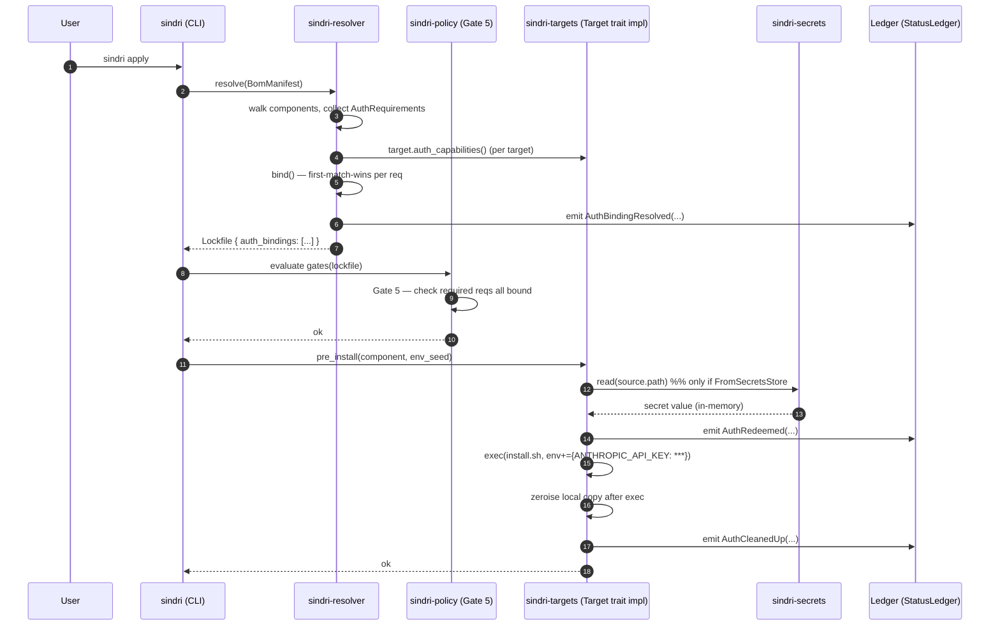
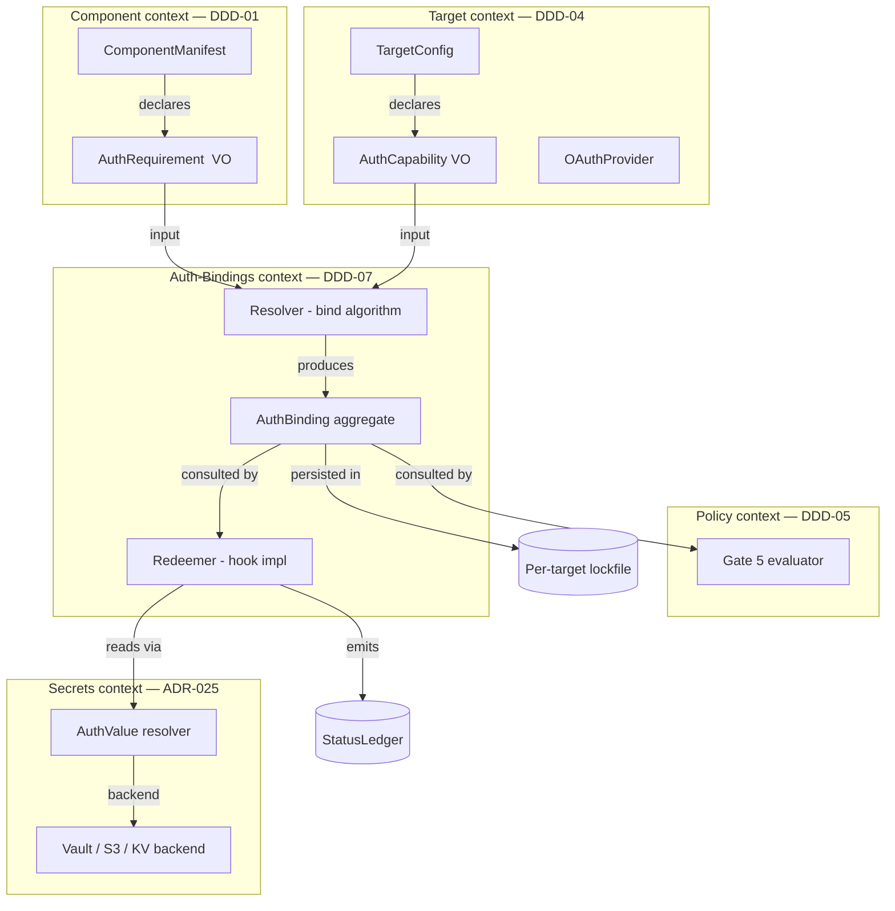

# DDD-07: Auth-Bindings Domain

**Status:** Proposed (paired with [ADR-026](../ADRs/026-auth-aware-components.md) and [ADR-027](../ADRs/027-target-auth-injection.md))
**Date:** 2026-04-28

## Bounded Context

The Auth-Bindings domain is a **thin orchestration context** sitting above
three existing bounded contexts (Component, Target, Secrets/Policy). It owns
exactly one new aggregate — `AuthBinding` — and a vocabulary that lets the
existing aggregates talk about credentials without leaking each other's
internals.

```
┌────────────────────┐  declares  ┌────────────────────────┐  fulfills   ┌────────────────────────┐
│   Component (DDD-01)├──────────▶│ AuthRequirement (VO)    │◀────────────│ Target (DDD-04)         │
└────────────────────┘             └─────────────┬──────────┘              └─────────────────────┬──┘
                                                 │                                                │
                                                 ▼ binds                                          │
                                        ┌────────────────────┐  references                       │
                                        │  AuthBinding (AR)   │──────────────────────────────────▶│
                                        └─────────┬──────────┘                                    │
                                                  │ references                                    │
                                                  ▼                                                │
                                        ┌────────────────────┐                                    │
                                        │ AuthSource (VO)     │◀──────────── Secrets / Env / OAuth / CLI / File providers
                                        └────────────────────┘
```

### Crate ownership

| Crate              | Owns                                                                                      |
| ------------------ | ----------------------------------------------------------------------------------------- |
| `sindri-core`      | Schema types: `AuthRequirement`, `AuthCapability`, `AuthBinding`, `AuthSource`, `Audience`. |
| `sindri-resolver`  | The binding algorithm; lockfile (de)serialisation of `auth_bindings`.                     |
| `sindri-policy`    | Gate 5 evaluator; `AuthPolicy` config block.                                              |
| `sindri-targets`   | `Target::auth_capabilities()` default + per-kind overrides; OAuth integration.            |
| `sindri-extensions` | Apply-time redemption (hook into `pre_install`/`post_install` of ADR-024).               |
| `sindri-secrets`   | `FromSecretsStore` resolution backend (existing).                                         |
| `sindri` (CLI)     | `auth show / auth refresh / doctor --auth` verbs (Phase 5).                               |

## Core Aggregate: `AuthBinding`

```
AuthBinding (aggregate root)
├── id              (deterministic: hash(component_id, requirement.name, target_id))
├── component_id    (ComponentId — DDD-01)
├── requirement     (AuthRequirement — VO, copied from component manifest)
├── target_id       (target name as string)
├── source          (AuthSource — VO, the bound source)
├── audience        (Audience — VO, must equal req.audience and source.audience)
├── bound_at        (UTC timestamp)
├── considered      (Vec<RejectedCandidate> — for `auth show` introspection)
└── status          (Bound | Deferred | Failed)
```

`AuthBinding` is computed at *resolve time* and persisted in the per-target
lockfile (PR #231). It is the only aggregate in this domain. `AuthRequirement`,
`AuthCapability`, `AuthSource`, and `Audience` are all value objects.

### Invariants enforced on construction

1. **Audience match.** `binding.audience == req.audience == source.audience`,
   matched as canonicalised, lower-cased strings. Constructor returns
   `Err(AudienceMismatch)` otherwise.
2. **Scope alignment.** `req.scope` must be representable by `source.kind` —
   e.g. `Prompt` cannot satisfy `scope: install` in a `--ci` context (Gate 5
   policy enforces this; the constructor records but does not block).
3. **No value capture.** `AuthBinding` has no field that contains the
   resolved credential. It is impossible at the type level (the `source`
   variant carries only path/key references).
4. **Determinism.** Given identical input (manifest + lockfile + target
   capabilities), the produced binding's `id`, `source`, and `priority` are
   identical across hosts. Lockfile diffs reflect intent changes only.

### Lifecycle states

```
   ┌──────────┐  bind() ok    ┌────────┐  redeem() ok  ┌──────────┐
   │ Pending  │──────────────▶│ Bound  │──────────────▶│ Redeemed │ (transient — not persisted)
   └──────────┘               └───┬────┘               └──────────┘
        │                         │ no source / required
        │                         ▼
        │                  ┌─────────┐
        ├──optional? ─────▶│ Deferred │  (warn, install proceeds)
        │                  └─────────┘
        │ required, no src
        ▼
    ┌────────┐
    │ Failed │  → admission Gate 5 denial
    └────────┘
```

`Redeemed` is intentionally not persisted — it's a momentary state during
apply, mirrored only as the `AuthRedeemed` domain event.

## Ubiquitous Language

| Term                  | Definition                                                                                                                                                                          |
| --------------------- | ----------------------------------------------------------------------------------------------------------------------------------------------------------------------------------- |
| **AuthRequirement**   | A component-declared statement "I need a credential of kind K, with audience A, optional or not, redeemed in form R." Lives in `ComponentManifest.auth.*`.                          |
| **AuthCapability**    | A target-advertised statement "I can produce a credential of id I, audience A, from source S." Returned by `Target::auth_capabilities()` and via `TargetConfig.provides`.            |
| **AuthBinding**       | The resolved triple of (requirement, target, source) plus enough metadata to redeem at apply time. The aggregate root of this domain.                                              |
| **AuthSource**        | The *physical* origin of a credential value: secrets store path, env var, file, CLI invocation, OAuth flow, prompt, or upstream-credential reuse. A pure `enum`.                   |
| **Audience**          | The intended-resource identifier of a credential. Free-form URL or URN; matched as canonical lowercased strings. Inspired by RFC 9068 `aud` claim. Matched literally — no globs.   |
| **Redemption**        | The act and *form* of materialising a bound credential at apply time: as an env var, as a file, or both. Declared per-requirement, executed in a lifecycle hook.                  |
| **Scope**             | When a credential is needed: `install` (lifecycle scripts only), `runtime` (when the installed tool is invoked), or `both`. Decides which lifecycle hook redeems.                   |
| **DiscoveryHints**    | Component-side aliases that help the resolver auto-bind without explicit `targets.<n>.provides` config: env-var aliases, CLI aliases, OAuth provider id.                            |
| **Gate 5**            | The new admission gate added by ADR-027: "every required `AuthRequirement` has exactly one `AuthBinding`." Blocks apply when violated.                                              |
| **CredentialProviderChain** | The ordered candidate list inside the resolver, walked first-match-wins. Modelled on the AWS SDK pattern; explicit and inspectable, never implicit.                          |

## Domain Events

Emitted into the existing ledger (`StatusLedger`, PR #217). All redact values.

| Event                          | Producer                | Payload (sketch)                                                       |
| ------------------------------ | ----------------------- | ---------------------------------------------------------------------- |
| `AuthRequirementDeclared`      | Component loader        | `component_id`, `requirement.name`, `audience`, `scope`, `optional`.   |
| `AuthCapabilityRegistered`     | Target init / plugin    | `target_id`, `capability.id`, `audience`, `source.kind`.               |
| `AuthBindingResolved`          | Resolver                | `binding.id`, `component_id`, `requirement.name`, `target_id`, `source.kind`, `priority`, `considered_count`. |
| `AuthBindingDeferred`          | Resolver                | `component_id`, `requirement.name`, `reason: "no source matched"`.     |
| `AuthBindingFailed`            | Resolver / Gate 5       | `component_id`, `requirement.name`, `reason`, `candidates_tried`.      |
| `AuthRedeemed`                 | Apply hook              | `binding.id`, `redemption.kind`, `target_id`, `phase: pre-install/post-install`. |
| `AuthCleanedUp`                | Apply hook (post-phase) | `binding.id`, `cleanup.kind: "env-zeroised" / "file-deleted" / "kept"`. |

## Sequence Diagram — apply-time, happy path



## Bounded-Context Diagram



## Boundary rules

1. **Component never touches secrets.** A component cannot declare a
   `secret:` path in its manifest. The component's only auth surface is
   `AuthRequirement` — *what*, never *where*.
2. **Target never touches the resolved value.** `Target::auth_capabilities()`
   returns *references* (`AuthSource`), never resolved strings. Resolution is
   the redeemer's job inside `sindri-extensions` apply hooks.
3. **Secrets backend is fulfillment-only.** `sindri-secrets` does not know
   about components, requirements, or audiences. It exposes
   `read(backend, path) -> SecretValue` and that's it.
4. **Policy never resolves.** Gate 5 inspects bindings and refuses to apply
   when invariants are violated; it never reads the actual value.
5. **The ledger always redacts.** No event payload contains a credential
   value. Tests assert this with a fuzzed-redaction property test.

## Mapping to existing v4 types

- `AuthValue` (ADR-020, `sindri-targets/src/auth.rs`) is the *redemption*
  primitive. It gains a fifth variant `Secret(SecretRef)` in Phase 0.
- `BomManifest.secrets` (manifest.rs:25) becomes a *named source registry* —
  i.e. `secrets.<id>: env:FOO` declares a named source, and a binding's
  `AuthSource::FromSecretsStore { backend: "manifest", path: "<id>" }` can
  reference it. (This is the most pleasant migration path for users who
  already use the secrets map.)
- `TargetConfig.auth` (manifest.rs:77) stays *control-plane* per ADR-020.
  Workload-plane fulfillment is `TargetConfig.provides` (this domain).

## References

- [Survey](../research/auth-aware-survey-2026-04-28.md)
- [ADR-026](../ADRs/026-auth-aware-components.md), [ADR-027](../ADRs/027-target-auth-injection.md)
- [Implementation plan](../plans/auth-aware-implementation-plan-2026-04-28.md)
- DDD-01 (Component), DDD-04 (Target), DDD-05 (Policy)
