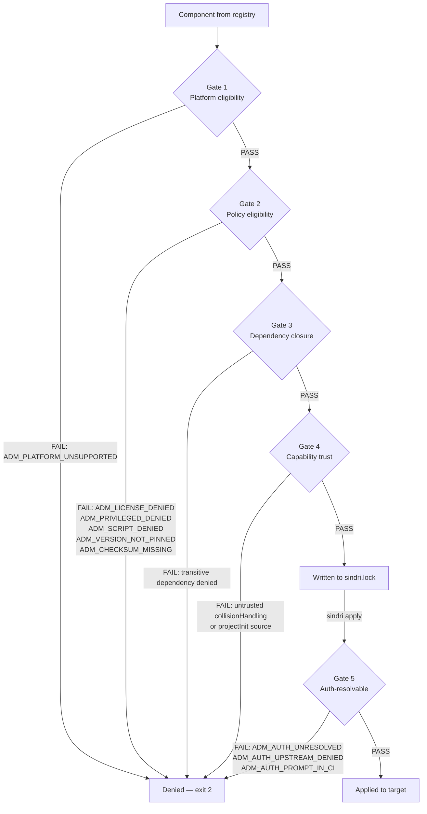

# Sindri v4 Policy Subsystem

This document describes the install policy system: admission gates, license deduplication, capability execution controls, and the denylist/allowlist semantics. It is aimed at security engineers, platform teams, and developers who need to enforce compliance constraints on Sindri-managed environments.

The design is documented in [ADR-008](ADRs/008-install-policy-subsystem.md). Gate 5 (auth-resolvable) is added in [ADR-027 §5](ADRs/027-target-auth-injection.md). For a quick start, see [CLI.md — Policy Management](CLI.md#policy-management). The policy schema is at [`v4/schemas/policy.json`](../schemas/policy.json).

---

## Overview

Sindri's policy subsystem is a first-class Rust crate (`sindri-policy`) that intercepts every `sindri resolve` and optionally every `sindri apply`. Policy is explicit, auditable, and version-controlled. There is no hidden enforcement; every denial produces a machine-readable code.

The default preset (`default`) is fully permissive — suitable for personal or home-lab use. The `strict` preset enforces the security requirements expected of production or regulated environments.

---

## Policy File Hierarchy

Policy is resolved by merging two files in order. Project-level settings override global defaults.

```
~/.sindri/policy.yaml           # user-global defaults
./sindri.policy.yaml            # project-level overrides (merged on top)
```

Both files are optional. An absent file is treated as empty (all defaults apply).

`sindri policy show` prints the effective merged policy with source annotations.

### Example `sindri.policy.yaml`

External YAML keys are **camelCase** end-to-end. Every struct sets
`deny_unknown_fields`, so misspelled keys fail loudly at deserialization.

```yaml
apiVersion: sindri.dev/v4
kind: InstallPolicy

preset: strict

licenses:
  allow:
    - MIT
    - Apache-2.0
    - BSD-2-Clause
    - BSD-3-Clause
    - ISC
    - MPL-2.0
  deny:
    - GPL-3.0-only
    - AGPL-3.0-only
    - BUSL-1.1
  onUnknown: warn   # allow | warn | prompt | deny

registries:
  requireSigned: true
  trust:
    - sindri/core
    - acme/internal

sources:
  requireChecksums: true
  requirePinnedVersions: true
  allowScriptBackend: prompt   # allow | warn | prompt | deny
  allowPrivileged: prompt

network:
  offline: false

capabilities:
  trustSources:
    collisionHandling:
      - sindri/core
    projectInit:
      - sindri/core
      - acme/internal
    mcpRegistration: "*"
    shellRcEdits:
      - sindri/core
      - acme/internal

audit:
  requireJustification: false

auth:
  onUnresolvedRequired: deny       # deny | warn | prompt
  allowUpstreamCredentials: false
  allowPromptInCi: false
```

**`apiVersion` / `kind`** are validated against the canonical strings
`sindri.dev/v4` and `InstallPolicy`. Any other value fails parsing.

---

## The Five Admission Gates

Every `sindri resolve` runs gates 1–4 in order. Gate 5 (auth-resolvable) runs at `sindri apply` time against the per-target lockfile's bindings. A failure at any gate prevents the component (and any component that depends on it) from being applied to the target.



### Gate 1 — Platform Eligibility

The component's `platforms:` list is intersected with the current `TargetProfile` (OS + architecture). If the current platform is not in the list, resolution fails with `ADM_PLATFORM_UNSUPPORTED`.

This gate is always enforced regardless of policy preset.

```
DENIED (1)
  apt:docker-ce  ADM_PLATFORM_UNSUPPORTED: no platform entry for macos-aarch64
                 → add macos-aarch64 to apt:docker-ce platforms: or use an override
```

### Gate 2 — Policy Eligibility

The resolved merged policy (global + project) is evaluated. Denial codes:

| Code | Trigger |
|------|---------|
| `ADM_LICENSE_DENIED` | Component license is in `licenses.deny`, or strict mode and not in `licenses.allow` |
| `ADM_LICENSE_UNKNOWN` | `metadata.license` is empty and `licenses.onUnknown: deny` |
| `ADM_PRIVILEGED_DENIED` | Component requires elevated privileges and `sources.allowPrivileged: deny` |
| `ADM_SCRIPT_DENIED` | Component uses `script` backend and `sources.allowScriptBackend: deny` |
| `ADM_VERSION_NOT_PINNED` | `sources.requirePinnedVersions: true` and a manifest entry is unpinned (`latest`, `^…`, `~…`, `>=…`, etc.) |
| `ADM_CHECKSUM_MISSING` | `sources.requireChecksums: true` and binary component has no checksums |

> **Note on `registries.requireSigned`:** This knob is enforced at *registry refresh time* — `sindri registry refresh` fails with `RegistryError::SignatureRequired` (or `InsecureForbiddenByPolicy` when `--insecure` is combined with a signed-required policy) before any admission gate runs. There is no `ADM_UNSIGNED_REGISTRY` admission code; the registry never reaches admission unsigned.

### Gate 3 — Dependency Closure

Every transitive dependency via `dependsOn` edges must pass gates 1 and 2. If any dependency in the closure is denied, the entire closure fails. `sindri resolve` shows the full dependency path:

```
DENIED (1)
  collection:jvm  ADM_LICENSE_DENIED via transitive dependency:
    collection:jvm → sdkman:groovy → license=Apache-2.0 ← allowed
    collection:jvm → sdkman:java   → license=GPL-2.0-CE ← DENIED
    → to allow: add GPL-2.0-CE to policy.licenses.allow
```

### Gate 4 — Capability Trust

Components that declare `capabilities.collisionHandling` or `capabilities.projectInit` from third-party registries are checked against `policy.capabilities.trustSources`. Untrusted sources are denied (or downgraded to a warning) per policy.

**Collision handling path prefix rule:** `collisionHandling.pathPrefix` must start with `{component-name}/`. This prevents a component from claiming collision ownership over paths it does not own. Components in `sindri/core` may additionally use `:shared` for cross-component shared paths.

The rule is enforced in **two places**, both calling the same checker in [`sindri-policy::capability_trust::check_collision_prefix`](../crates/sindri-policy/src/capability_trust.rs):

1. **Publish time** — `sindri registry lint` emits `LINT_COLLISION_PREFIX` for any violation, blocking publish.
2. **Resolve time** — `sindri-resolver::admission::check_capability_trust` emits `ADM_CAPABILITY_TRUST_VIOLATION` and denies admission. Defense-in-depth catches manifests that were tampered with after publish, or shipped from registries that skipped lint.

See [ADR-008](ADRs/008-install-policy-subsystem.md).

### Gate 5 — Auth-resolvable

Verifies that every non-`optional` `AuthRequirement` declared by a component in the resolved closure has a bound source on the target's per-target lockfile, AND that the bound source is admissible under operator policy. Implemented in [`sindri-policy::gate5_auth`](../crates/sindri-policy/src/gate5_auth.rs); designed in [ADR-027 §5](ADRs/027-target-auth-injection.md).

Unlike Gates 1–4 (which run at `sindri resolve` against the registry), Gate 5 runs at `sindri apply` against the lockfile's `AuthBinding` records. A required binding that the resolver could not bind (env var missing, no `provides:` mapping the audience, no `discovery.env-aliases` match) reaches apply as an unresolved entry; Gate 5 denies before any side effect runs.

Configured under `auth:` in `sindri.policy.yaml`. All three knobs default to **deny / false** — operators must opt into each relaxation explicitly.

| Code | Trigger |
|------|---------|
| `ADM_AUTH_UNRESOLVED` | `auth.onUnresolvedRequired: deny` and a required binding is unresolved on the target |
| `ADM_AUTH_UPSTREAM_DENIED` | `auth.allowUpstreamCredentials: false` and a binding is sourced via `from-upstream-credentials` |
| `ADM_AUTH_PROMPT_IN_CI` | `auth.allowPromptInCi: false` and a binding's source is `prompt` in a non-interactive run |

**Non-interactive detection:** `CI` env var present, `SINDRI_CI` env var present, or stdin not attached to a TTY (Unix only; Windows is treated as non-interactive by default).

#### `licenses.onUnknown`

| Value | Behaviour |
|-------|-----------|
| `allow` | Empty `license:` is admitted silently. |
| `warn` | (default for `default` preset) Empty `license:` admitted with a warn log. |
| `prompt` | Reserved — interactive resolution. Not currently active. |
| `deny` | (default for `strict` preset) Empty `license:` is denied with `ADM_LICENSE_UNKNOWN`. |

#### `registries.requireSigned` and `registries.trust`

`registries.requireSigned: true` makes every `sindri registry refresh` fetch fail closed unless a trusted cosign key matches the index signature. `registries.trust` is an optional allow-list of registry aliases — when non-empty, any alias outside the list is rejected at refresh time.

#### `sources.requirePinnedVersions`

When `true`, the resolver rejects any manifest entry whose version specifier is not an exact pin. Disallowed forms: empty, `latest`, `*`, `^…`, `~…`, `>=…`, `<…`. Use this in CI to enforce reproducibility (`ADM_VERSION_NOT_PINNED`).

#### `sources.allowScriptBackend`

`PolicyAction` for components installed via the `script` backend. `deny` blocks them outright (`ADM_SCRIPT_DENIED`); `prompt` is the `strict`-preset default and is treated as advisory (admit with a warn) until interactive resolution lands.

#### `sources.allowPrivileged`

`PolicyAction` for components that declare `requiresElevation: true` in their manifest. `deny` blocks them (`ADM_PRIVILEGED_DENIED`).

#### `auth.onUnresolvedRequired`

| Value | Behaviour |
|-------|-----------|
| `deny` | (default) Apply fails with `EXIT_POLICY_DENIED` if any required-and-unbound binding exists. |
| `warn` | Logs a `tracing::warn!` and admits. The install will likely fail at first run. |
| `prompt` | Reserved — interactive resolution. Not currently active. |

Use `warn` only when you intentionally need a "best-effort" install (e.g. base-image bake where credentials will be supplied later via cloud-init). Document the choice; revisit during audit.

#### `auth.allowUpstreamCredentials`

| Value | Behaviour |
|-------|-----------|
| `false` | (default) Bindings whose source is `from-upstream-credentials` are denied. |
| `true` | Bindings can reuse the target's own session credentials. |

The target's session token (e.g. an SSH-agent-forwarded GitHub-app installation token) becomes available to every component that declares a matching audience. A maliciously-crafted manifest matching the audience can harvest the token. ADR-014 trust-on-install applies, but treat `allowUpstreamCredentials: true` as a privileged setting.

#### `auth.allowPromptInCi`

| Value | Behaviour |
|-------|-----------|
| `false` | (default) Bindings whose source is `prompt` are denied in non-interactive runs. |
| `true` | Prompt sources are allowed even when no TTY is present / `CI=1` is set. |

Without this gate, an apply that needs an interactive credential (SSH passphrase, MFA token) hangs on `stdin.read_line()` until the CI runner times out. There is almost never a legitimate reason to enable this on production CI; the right answer is to switch the credential to a backed source (env var, secrets store).

#### Interaction with `sindri apply --skip-auth`

`--skip-auth` bypasses **redemption** but does NOT bypass Gate 5. Required-binding presence is still enforced. To bypass both, operators must additionally relax `auth.onUnresolvedRequired` to `warn`.

This split is intentional: `--skip-auth` is for "I know my credentials are out-of-band and will inject them another way"; the gate is for "there exists a bound source somewhere". Different concerns, separate overrides, both auditable in `~/.sindri/ledger.jsonl`.

---

## License Deduplication

When multiple components in the closure declare the same license, the policy engine deduplicates before evaluating `licenses.allow` / `licenses.deny`. A single allow-list entry covers every component with that license.

`sindri resolve` prints a structured admission report:

```
ADMITTED (12)
  mise:nodejs@22.0.0     license=MIT, signed by sindri/core
  npm:claude-code@1.0.0  license=MIT, signed by sindri/core
  binary:gh@2.67.0       license=MIT, signed by sindri/core
  mise:python@3.14.0     license=PSF-2.0, signed by sindri/core
  ...

DENIED (2)
  vendor/closed:foo@1.0.0  license=proprietary (policy: licenses.deny)
                            → to allow: sindri policy allow-license proprietary
                              or add to sindri.policy.yaml licenses.allow
  apt:docker-ce            ADM_PLATFORM_UNSUPPORTED: macos-aarch64 not in platforms
```

---

## Capability Execution Controls

The `capabilities:` block in `sindri.policy.yaml` controls which registries are trusted to execute each capability type at apply time.

| Capability | Default trusted sources | Description |
|------------|-------------------------|-------------|
| `collisionHandling` | `sindri/core` | Registries trusted to declare path-prefix collision rules |
| `projectInit` | `sindri/core` | Registries trusted to run project-init steps post-install |
| `mcpRegistration` | `*` (any) | Registries trusted to register MCP servers |
| `shellRcEdits` | `sindri/core` | Registries trusted to edit shell RC files |

Setting a source list to `"*"` (string) trusts any registry. Setting to an empty list `[]` denies all third-party sources for that capability.

---

## Denylist and Allowlist Semantics

The evaluation order is:

1. `licenses.deny` is checked first. An explicit deny always wins.
2. In `strict` preset, `licenses.allow` is an allowlist — only listed licenses pass. Any unlisted license is denied with `ADM_LICENSE_DENIED`.
3. In `default` preset, `licenses.allow` is a hint (not enforced). Any license not in `deny` passes.
4. Unknown licenses (empty `metadata.license`) are handled by `onUnknown`: `allow`, `warn` (default), `prompt`, or `deny`.

```bash
# Add a license to the global allow list
sindri policy allow-license BUSL-1.1 --reason "vendor contract SA-2342"

# View effective policy
sindri policy show
```

---

## Policy Presets

Three named presets are available:

| Preset | Description |
|--------|-------------|
| `default` | Permissive. No license restrictions. `onUnknown: warn`. Signing not required. Suitable for personal use. |
| `strict` | Pinned versions required (`sources.requirePinnedVersions: true`). Registries must be signed. `licenses.onUnknown: deny`. Only allow-listed licenses pass. `sources.allowScriptBackend: prompt`. `sources.allowPrivileged: prompt`. `audit.requireJustification: true`. |
| `offline` | All network access disabled (`network.offline: true`). Extends `strict`. |

```bash
sindri policy use strict    # sets ~/.sindri/policy.yaml preset: strict
sindri policy use default   # reverts to permissive
sindri init --policy strict # init with strict policy baked into the project
```

---

## Forced Overrides and Audit Trail

Policy overrides are allowed but every override is appended to the StatusLedger (`~/.sindri/ledger.jsonl`) with timestamp, user, and optional reason.

When `policy.audit.requireJustification: true`, the `--reason` flag is mandatory for overrides:

```bash
sindri resolve --allow-license proprietary --reason "vendor contract SA-2342"
```

Ledger entries are viewable with:

```bash
sindri log --json | jq '.[] | select(.event_type == "policy_override")'
```

---

## Gate Implementation Status

| Gate | Status | Reference |
|------|--------|-----------|
| Gate 1 — Platform eligibility | Implemented | [ADR-008](ADRs/008-install-policy-subsystem.md) |
| Gate 2 — Policy eligibility | Implemented (`sindri-policy::check`: license, version-pinning, script-backend, privileged, checksum checks) | [ADR-008](ADRs/008-install-policy-subsystem.md) |
| Gate 3 — Dependency closure | Implemented (topological DAG in resolver) | [ADR-008](ADRs/008-install-policy-subsystem.md) |
| Gate 4 — Capability trust | Implemented — single collision-prefix checker in `sindri-policy::capability_trust` is called from both `registry lint` (publish-time) and `sindri-resolver::admission` (resolve-time); defense in depth | [ADR-008](ADRs/008-install-policy-subsystem.md) |
| Gate 5 — Auth-resolvable | Implemented (`sindri-policy::gate5_auth::check_gate5`) | [ADR-027 §5](ADRs/027-target-auth-injection.md) |

Full script sandboxing (Landlock/Seatbelt/AppContainer) and SLSA L3+ attestation chains are deferred beyond v4.0. Gate 5's `auth.onUnresolvedRequired: prompt` value is reserved for a future interactive-resolution flow and is not currently honored at runtime.
