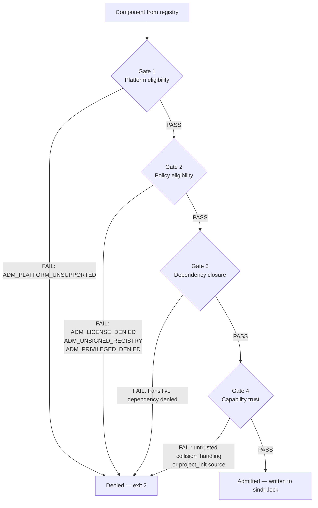

# Sindri v4 Policy Subsystem

This document describes the install policy system: admission gates, license deduplication, capability execution controls, and the denylist/allowlist semantics. It is aimed at security engineers, platform teams, and developers who need to enforce compliance constraints on Sindri-managed environments.

The design is documented in [ADR-008](architecture/adr/008-install-policy-subsystem.md). For a quick start, see [CLI.md — Policy Management](CLI.md#policy-management). The policy schema is at [`v4/schemas/policy.json`](../schemas/policy.json).

---

## Overview

Sindri's policy subsystem is a first-class Rust crate (`sindri-policy`) that intercepts every `sindri resolve` and optionally every `sindri apply`. Policy is explicit, auditable, and version-controlled. There is no hidden enforcement; every denial produces a machine-readable code.

The default preset (`default`) is fully permissive — suitable for personal or home-lab use. The `strict` preset enforces the security requirements expected of production or regulated environments.

---

## Policy File Hierarchy

Policy is resolved by merging two files in order. Project-level settings override global defaults.

```
~/.sindri/policy.yaml           # user-global defaults
./sindri.policy.yaml            # project-level overrides (merged on top)
```

Both files are optional. An absent file is treated as empty (all defaults apply).

`sindri policy show` prints the effective merged policy with source annotations.

### Example `sindri.policy.yaml`

```yaml
apiVersion: sindri.dev/v4
kind: InstallPolicy

preset: strict

licenses:
  allow:
    - MIT
    - Apache-2.0
    - BSD-2-Clause
    - BSD-3-Clause
    - ISC
    - MPL-2.0
  deny:
    - GPL-3.0-only
    - AGPL-3.0-only
    - BUSL-1.1
  onUnknown: warn   # allow | warn | prompt | deny

registries:
  require_signed: true
  trust:
    - sindri/core
    - acme/internal

sources:
  require_checksums: true
  require_pinned_versions: true
  allow_script_backend: prompt   # allow | warn | prompt | deny
  allow_privileged: prompt

network:
  offline: false

capabilities:
  trust_sources:
    collision_handling:
      - sindri/core
    project_init:
      - sindri/core
      - acme/internal
    mcp_registration: "*"
    shell_rc_edits:
      - sindri/core
      - acme/internal

audit:
  require_justification: false
```

---

## The Four Admission Gates

Every `sindri resolve` runs all four gates in order. A failure at any gate prevents the component (and any component that depends on it) from entering the lockfile.



### Gate 1 — Platform Eligibility

The component's `platforms:` list is intersected with the current `TargetProfile` (OS + architecture). If the current platform is not in the list, resolution fails with `ADM_PLATFORM_UNSUPPORTED`.

This gate is always enforced regardless of policy preset.

```
DENIED (1)
  apt:docker-ce  ADM_PLATFORM_UNSUPPORTED: no platform entry for macos-aarch64
                 → add macos-aarch64 to apt:docker-ce platforms: or use an override
```

### Gate 2 — Policy Eligibility

The resolved merged policy (global + project) is evaluated. Denial codes:

| Code | Trigger |
|------|---------|
| `ADM_LICENSE_DENIED` | Component license is in `licenses.deny`, or strict mode and not in `licenses.allow` |
| `ADM_LICENSE_UNKNOWN` | `metadata.license` is empty and `onUnknown: deny` |
| `ADM_UNSIGNED_REGISTRY` | `registries.require_signed: true` and registry has no trusted key |
| `ADM_PRIVILEGED_DENIED` | Component requires elevated privileges and `sources.allow_privileged: deny` |
| `ADM_SCRIPT_DENIED` | Component uses `script` backend and `sources.allow_script_backend: deny` |
| `ADM_CHECKSUM_MISSING` | `sources.require_checksums: true` and binary component has no checksums |

### Gate 3 — Dependency Closure

Every transitive dependency via `dependsOn` edges must pass gates 1 and 2. If any dependency in the closure is denied, the entire closure fails. `sindri resolve` shows the full dependency path:

```
DENIED (1)
  collection:jvm  ADM_LICENSE_DENIED via transitive dependency:
    collection:jvm → sdkman:groovy → license=Apache-2.0 ← allowed
    collection:jvm → sdkman:java   → license=GPL-2.0-CE ← DENIED
    → to allow: add GPL-2.0-CE to policy.licenses.allow
```

### Gate 4 — Capability Trust

Components that declare `capabilities.collision_handling` or `capabilities.project_init` from third-party registries are checked against `policy.capabilities.trust_sources`. Untrusted sources are denied (or downgraded to a warning) per policy.

**Collision handling path prefix rule:** `collision_handling.path_prefix` must start with `{component-name}/`. This prevents a component from claiming collision ownership over paths it does not own. Components in `sindri/core` may additionally use `:shared` for cross-component shared paths. See [ADR-008](architecture/adr/008-install-policy-subsystem.md) and the lint error `LINT_COLLISION_PREFIX`.

---

## License Deduplication

When multiple components in the closure declare the same license, the policy engine deduplicates before evaluating `licenses.allow` / `licenses.deny`. A single allow-list entry covers every component with that license.

`sindri resolve` prints a structured admission report:

```
ADMITTED (12)
  mise:nodejs@22.0.0     license=MIT, signed by sindri/core
  npm:claude-code@1.0.0  license=MIT, signed by sindri/core
  binary:gh@2.67.0       license=MIT, signed by sindri/core
  mise:python@3.14.0     license=PSF-2.0, signed by sindri/core
  ...

DENIED (2)
  vendor/closed:foo@1.0.0  license=proprietary (policy: licenses.deny)
                            → to allow: sindri policy allow-license proprietary
                              or add to sindri.policy.yaml licenses.allow
  apt:docker-ce            ADM_PLATFORM_UNSUPPORTED: macos-aarch64 not in platforms
```

---

## Capability Execution Controls

The `capabilities:` block in `sindri.policy.yaml` controls which registries are trusted to execute each capability type at apply time.

| Capability | Default trusted sources | Description |
|------------|-------------------------|-------------|
| `collision_handling` | `sindri/core` | Registries trusted to declare path-prefix collision rules |
| `project_init` | `sindri/core` | Registries trusted to run project-init steps post-install |
| `mcp_registration` | `*` (any) | Registries trusted to register MCP servers |
| `shell_rc_edits` | `sindri/core` | Registries trusted to edit shell RC files |

Setting a source list to `"*"` (string) trusts any registry. Setting to an empty list `[]` denies all third-party sources for that capability.

---

## Denylist and Allowlist Semantics

The evaluation order is:

1. `licenses.deny` is checked first. An explicit deny always wins.
2. In `strict` preset, `licenses.allow` is an allowlist — only listed licenses pass. Any unlisted license is denied with `ADM_LICENSE_DENIED`.
3. In `default` preset, `licenses.allow` is a hint (not enforced). Any license not in `deny` passes.
4. Unknown licenses (empty `metadata.license`) are handled by `onUnknown`: `allow`, `warn` (default), `prompt`, or `deny`.

```bash
# Add a license to the global allow list
sindri policy allow-license BUSL-1.1 --reason "vendor contract SA-2342"

# View effective policy
sindri policy show
```

---

## Policy Presets

Three named presets are available:

| Preset | Description |
|--------|-------------|
| `default` | Permissive. No license restrictions. `onUnknown: warn`. Signing not required. Suitable for personal use. |
| `strict` | Pinned versions required. Registries must be signed. `onUnknown: deny`. Only allow-listed licenses pass. `allow_script_backend: prompt`. |
| `offline` | All network access disabled (`network.offline: true`). Extends `strict`. |

```bash
sindri policy use strict    # sets ~/.sindri/policy.yaml preset: strict
sindri policy use default   # reverts to permissive
sindri init --policy strict # init with strict policy baked into the project
```

---

## Forced Overrides and Audit Trail

Policy overrides are allowed but every override is appended to the StatusLedger (`~/.sindri/ledger.jsonl`) with timestamp, user, and optional reason.

When `policy.audit.require_justification: true`, the `--reason` flag is mandatory for overrides:

```bash
sindri resolve --allow-license proprietary --reason "vendor contract SA-2342"
```

Ledger entries are viewable with:

```bash
sindri log --json | jq '.[] | select(.event_type == "policy_override")'
```

---

## Gate Implementation Status

| Gate | Status | Reference |
|------|--------|-----------|
| Gate 1 — Platform eligibility | Implemented | [ADR-008](architecture/adr/008-install-policy-subsystem.md), [PR #205](https://github.com/pacphi/sindri/pull/205) |
| Gate 2 — Policy eligibility | Implemented (license check in `sindri-policy::check`) | [ADR-008](architecture/adr/008-install-policy-subsystem.md) |
| Gate 3 — Dependency closure | Implemented (topological DAG in resolver) | [ADR-008](architecture/adr/008-install-policy-subsystem.md) |
| Gate 4 — Capability trust | Implemented (collision path prefix enforced in `registry lint`) | [ADR-008](architecture/adr/008-install-policy-subsystem.md) |

Full script sandboxing (Landlock/Seatbelt/AppContainer) and SLSA L3+ attestation chains are deferred beyond v4.0.
