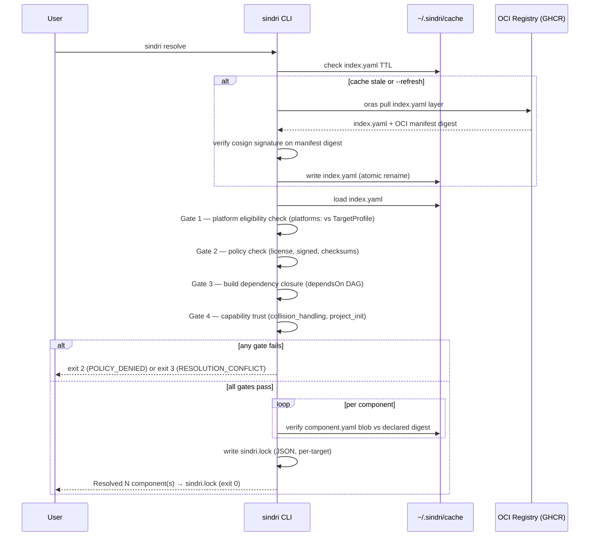
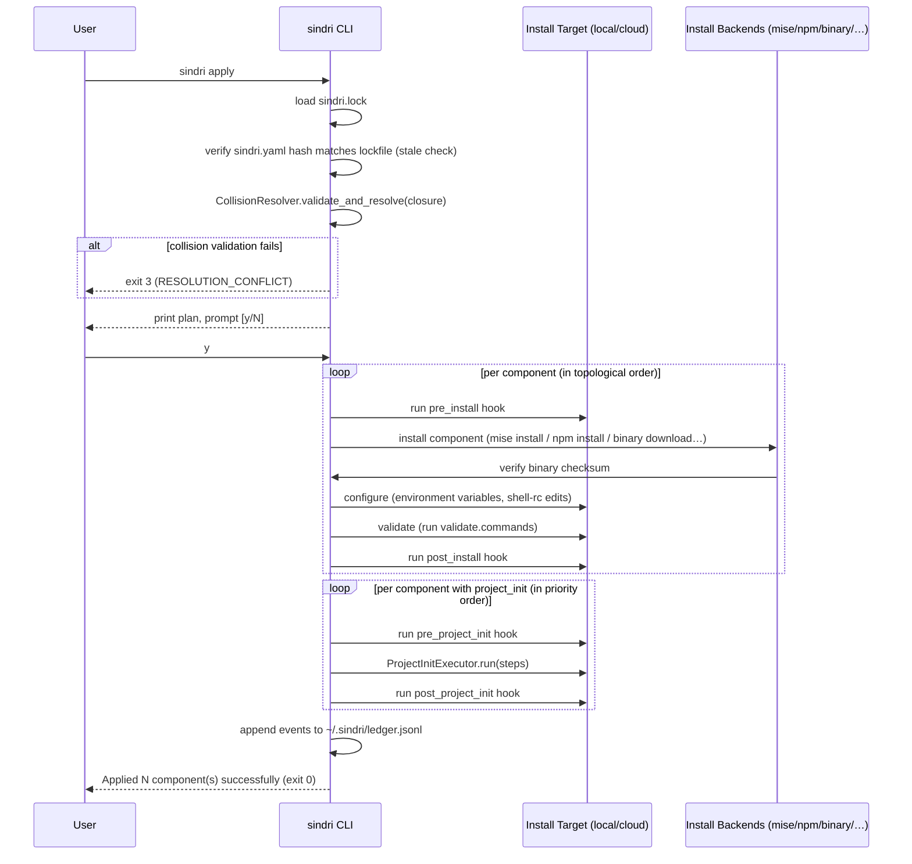

# Sindri v4 Registry

This document covers the OCI registry design, cosign verification flow, the publish workflow, and sequence diagrams for the two critical runtime operations: `resolve` and `apply`. It is aimed at registry maintainers and platform engineers who need to operate or mirror a Sindri registry. Component authors who only want to write manifests should start with [AUTHORING.md](AUTHORING.md). For the layer *above* OCI — how the four registry source modes (`oci`, `local-path`, `git`, `local-oci`) compose and when to reach for each — see [SOURCES.md](SOURCES.md).

Design decisions are documented in [ADR-003](architecture/adr/003-oci-only-registry-distribution.md) (OCI-only transport), [ADR-014](architecture/adr/014-signed-registries-cosign.md) (cosign signing), [ADR-016](architecture/adr/016-registry-tag-cadence.md) (tag cadence), and [ADR-028](ADRs/028-component-source-modes.md) (component source modes).

---

## Why OCI

Sindri v4 uses OCI as the only production registry transport. The key properties that motivated this choice (over git) are:

- **Content-addressability** — every artifact layer is identified by its SHA-256 digest. Two machines pulling the same digest get identical bits.
- **Immutable tags** — monthly and patch tags are never re-pushed; OCI registries enforce this.
- **Native signing** — cosign attaches signatures to the manifest digest; no GPG key management or webhook setup needed.
- **Corporate mirrors** — any OCI-compliant registry (GHCR, ECR, Harbor, Artifactory) is a valid Sindri registry mirror.
- **Offline support** — OCI layout spec (`oci://path/to/dir`) provides a standard local cache format.

See [ADR-003](architecture/adr/003-oci-only-registry-distribution.md) for the full analysis.

---

## Artifact Structure

The canonical registry is `oci://ghcr.io/sindri-dev/registry-core:<tag>`. Its OCI artifact contains a single tarball layer with the following layout:

```
registry-core:<tag>/
├── manifest.json               (OCI artifact manifest)
├── signatures/                 (cosign signature objects)
└── layers/ (tarball):
    ├── index.yaml              (lightweight catalog, one entry per component)
    ├── components/             (atomic components — one directory per tool)
    │   ├── nodejs/
    │   │   └── component.yaml
    │   ├── python/
    │   │   └── component.yaml
    │   └── gh/
    │       └── component.yaml
    ├── collections/            (meta-components, sibling of components/)
    │   └── anthropic-dev/
    │       └── component.yaml
    └── checksums/
        └── sha256sums
```

Component directories use the **simple name** from `metadata.name` — no backend prefix. The backend is encoded in the `install:` block of `component.yaml` and in the `backend` field of `index.yaml`.

The disk layout mirrors this structure at [`v4/registry-core/`](../registry-core/).

---

## `index.yaml` Format

`index.yaml` is the lightweight catalog that `sindri resolve` reads without unpacking individual component manifests. Each entry contains enough information for resolution and policy gate 1 (platform) and gate 2 (policy).

```yaml
apiVersion: sindri.dev/v4
kind: RegistryIndex
components:
  - name: nodejs
    backend: mise
    latest: "22.0.0"
    versions:
      - "22.0.0"
      - "20.17.0"
    license: MIT
    description: "Node.js JavaScript runtime via mise"
    oci_ref: "ghcr.io/sindri-dev/registry-core/nodejs:22.0.0"
    digest: "sha256:abc123..."
    depends_on: []
    tags:
      - runtime
      - javascript
```

The `digest` field is the SHA-256 of the `component.yaml` blob. `sindri resolve` verifies each blob against this digest before using it.

---

## Tag Semantics ([ADR-016](architecture/adr/016-registry-tag-cadence.md))

| Tag pattern | Semantics | Mutable? |
|-------------|-----------|----------|
| `YYYY.MM` | Monthly tag (cut on the 1st) | **Immutable** — never re-pushed |
| `YYYY.MM.N` | Patch tag for additions between monthlies | Immutable |
| `:latest` | Rolling pointer — tracks newest immutable patch tag | Yes (pointer only) |
| `:stable` | Rolling pointer — tracks blessed-stable | Yes (pointer only) |

Users pin their registries to a tag in `sindri.yaml`:

```yaml
registries:
  - name: core
    url: oci://ghcr.io/sindri-dev/registry-core:2026.04
```

A pin to `:2026.04` resolves to the latest patch tag under that monthly (e.g., `:2026.04.3`) at resolve time. The resolved digest is captured in `sindri.lock` regardless of which pointer was used, guaranteeing reproducibility.

---

## Cosign Verification Flow ([ADR-014](architecture/adr/014-signed-registries-cosign.md))

### Trust model

| Source | Trust level |
|--------|-------------|
| `sindri/core` (published by sindri-dev) | Always trusted — hardcoded public key in the CLI binary |
| User-added registries | Must explicitly `sindri registry trust <name> --signer cosign:key=<path>` |
| Registries added with `--no-verify` | Added without signature; logged as unverified in the StatusLedger; surfaced as a warning at resolve time |

Sindri enforces **three independent integrity checks**, each at a distinct layer boundary:

1. `sindri registry refresh` — verifies the cosign signature on the OCI manifest before writing the index to cache. Failure aborts with the stale index left in place (fail-closed, not fail-open).
2. `sindri resolve` — verifies each `component.yaml` blob's SHA-256 digest against the digest declared in `index.yaml`. Any mismatch is a hard error.
3. `sindri apply` — verifies downloaded binary artifacts against the checksums declared in `component.yaml` before executing them.

### Registering a trusted key

```bash
# Trust a cosign P-256 SPKI PEM public key for registry "acme"
sindri registry trust acme --signer cosign:key=./acme-registry-signing.pub
```

The key is validated as a P-256 SPKI PEM and stored at `~/.sindri/trust/acme/cosign-<key-id>.pub`.

### Keyless OIDC

Keyless OIDC signing (Sigstore Fulcio + Rekor transparency log) is architecturally supported by the cosign integration but is **deferred** to a future wave. Today only key-based signing is active.

---

## Publish Workflow ([ADR-016](architecture/adr/016-registry-tag-cadence.md))

The CI workflow at `.github/workflows/registry-core-publish.yml` (on `main` branch) drives the monthly and patch publish process. The pipeline steps are:

1. Validate all `component.yaml` files with `sindri registry lint`.
2. Build the tarball layer from `v4/registry-core/`.
3. Push the OCI artifact with `oras push`.
4. Sign the manifest digest with `cosign sign`.
5. Update the rolling `:latest` and `:stable` pointers.
6. Create a GitHub release entry for the new tag.

Tag immutability is enforced by the workflow: it calls `oras manifest fetch` before push and fails if the tag already exists.

---

## Resolve Flow Sequence

The following diagram shows what happens when a user runs `sindri resolve`.



---

## Apply Flow Sequence

The following diagram shows what happens when a user runs `sindri apply`.



---

## Local Development Registry

Component authors can work against a local registry without pushing to GHCR:

```bash
# In sindri.yaml, use the local protocol
registries:
  - name: dev
    url: registry:local:./v4/registry-core

# Refresh the local index into cache
sindri registry refresh dev registry:local:./v4/registry-core

# Resolve against the local registry
sindri resolve
```

The `registry:local:<path>` loader reads `<path>/index.yaml` directly and skips cosign verification (no OCI manifest to sign). Lint validation still runs.

---

## Air-Gapped / Offline Mirroring

Full air-gapped spec is deferred to v4.1, but the mechanism is standard OCI:

```bash
# Mirror from GHCR to a private registry
skopeo copy \
  oci://ghcr.io/sindri-dev/registry-core:2026.04 \
  oci://my-host/sindri/registry-core:2026.04

# Point your sindri.yaml at the mirror
registries:
  - name: core
    url: oci://my-host/sindri/registry-core:2026.04
```

`sindri resolve --offline` uses the cached index and fails loudly if the cache is stale (exit code 5).

---

## Corporate / Private Registries

OCI auth follows the standard Docker credential store (`~/.docker/config.json` or the platform keychain). No separate credential mechanism is needed:

```bash
# Authenticate with your OCI registry (e.g., GitHub PAT)
echo "$GITHUB_TOKEN" | docker login ghcr.io -u $GITHUB_USER --password-stdin

# Add the private registry to sindri.yaml
registries:
  - name: acme-internal
    url: oci://ghcr.io/acme-org/sindri-registry:stable

# Trust the registry's signing key
sindri registry trust acme-internal --signer cosign:key=./acme-public.pub
```
